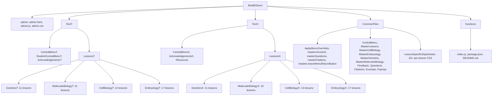

# BioMEDirect — Project Structure

This document gives you a **JSON tree** of the entire software hierarchy and a **Mermaid diagram** for visual navigation. Use it to see exactly what the project contains in both text and visual form.

---

## JSON Tree

Copy-pasteable, valid JSON. `node_modules` is excluded from the tree. Lesson folders are listed by name only; see **Conventions** for what typically lives inside each.

```json
{
  "name": "BioMEDirect",
  "type": "directory",
  "_note": "node_modules excluded from tree",
  "children": [
    { "name": "admin.html", "type": "file" },
    { "name": "admin.js", "type": "file" },
    { "name": "admin.css", "type": "file" },
    { "name": "package.json", "type": "file" },
    { "name": "package-lock.json", "type": "file" },
    { "name": "firebase.json", "type": "file" },
    { "name": ".firebaserc", "type": "file" },
    { "name": ".gitignore", "type": "file" },
    { "name": "link_audit.json", "type": "file" },
    {
      "name": "TextT",
      "type": "directory",
      "children": [
        { "name": "CentralMenuT.html", "type": "file" },
        { "name": "StudentCentralMenuT.html", "type": "file" },
        { "name": "AcknowledgementsT.html", "type": "file" },
        { "name": "ResourcesCentralMenuT.html", "type": "file" },
        {
          "name": "LessonsT",
          "type": "directory",
          "_contents": "Per-lesson folders: LessonNameT.html, LessonNameT.js, *_src_array.js, PopUps/, Excerpts/, Feedback*, Questions*, Citations*, vi*.html",
          "children": [
            {
              "name": "GeneticsT",
              "type": "directory",
              "children": [
                { "name": "MendelianGeneticsT", "type": "directory" },
                { "name": "NonMendelianGeneticsT", "type": "directory" },
                { "name": "SexualGeneticsT", "type": "directory" },
                { "name": "LinkageAnalysisT", "type": "directory" },
                { "name": "PopulationGeneticsT", "type": "directory" },
                { "name": "MultifactorialInheritanceT", "type": "directory" },
                { "name": "PedigreeAnalysisT", "type": "directory" },
                { "name": "PracticePedigreeRecognitionT", "type": "directory" },
                { "name": "InheritancePatternsT", "type": "directory" },
                { "name": "GeneralCytogeneticsT", "type": "directory" },
                { "name": "CytogeneticDefectsT", "type": "directory" }
              ]
            },
            {
              "name": "MolecularBiologyT",
              "type": "directory",
              "children": [
                { "name": "NucleicAcidStructureT", "type": "directory" },
                { "name": "ChromosomalStructureT", "type": "directory" },
                { "name": "GenomicOrganizationT", "type": "directory" },
                { "name": "ReplicationT", "type": "directory" },
                { "name": "TranscriptionT", "type": "directory" },
                { "name": "TranslationT", "type": "directory" },
                { "name": "RegulationT", "type": "directory" },
                { "name": "MutationT", "type": "directory" },
                { "name": "OncogenesisT", "type": "directory" },
                { "name": "TechniquesT", "type": "directory" },
                { "name": "StemCellGeneTherapyT", "type": "directory" }
              ]
            },
            {
              "name": "CellBiologyT",
              "type": "directory",
              "children": [
                { "name": "DivisionT", "type": "directory" },
                { "name": "BiomembranesT", "type": "directory" },
                { "name": "OrganellesT", "type": "directory" },
                { "name": "TransportProteinsT", "type": "directory" },
                { "name": "CytoskeletonIntroductionT", "type": "directory" },
                { "name": "MicrofilamentsT", "type": "directory" },
                { "name": "MicrotubulesT", "type": "directory" },
                { "name": "IntermediateFilamentsT", "type": "directory" },
                { "name": "ExtracellularMatrixT", "type": "directory" },
                { "name": "JunctionsT", "type": "directory" },
                { "name": "TensegrityT", "type": "directory" },
                { "name": "ReceptorSignalingT", "type": "directory" },
                { "name": "MolecularDivisionT", "type": "directory" },
                { "name": "CellCycleControlT", "type": "directory" }
              ]
            },
            {
              "name": "EmbryologyT",
              "type": "directory",
              "children": [
                { "name": "OrientationsT", "type": "directory" },
                { "name": "GestationalOverviewT", "type": "directory" },
                { "name": "DifferentiationT", "type": "directory" },
                { "name": "GametogenesisT", "type": "directory" },
                { "name": "CleavageStageT", "type": "directory" },
                { "name": "BilaminarT", "type": "directory" },
                { "name": "TrilaminarT", "type": "directory" },
                { "name": "MesodermT", "type": "directory" },
                { "name": "PharyngealMorphogenesisT", "type": "directory" },
                { "name": "NeurogenesisT", "type": "directory" },
                { "name": "SkeletogenesisT", "type": "directory" },
                { "name": "DigestiveTractT", "type": "directory" },
                { "name": "UrogenitalT", "type": "directory" },
                { "name": "PlacentalMorphogenesisT", "type": "directory" },
                { "name": "CardiogenesisT", "type": "directory" },
                { "name": "TeratologyT", "type": "directory" },
                { "name": "PrenatalDefectsT", "type": "directory" }
              ]
            }
          ]
        }
      ]
    },
    {
      "name": "TextX",
      "type": "directory",
      "children": [
        { "name": "CentralMenuX.html", "type": "file" },
        { "name": "CentralMenu2CollumnsX.html", "type": "file" },
        { "name": "ResourcesCentralMenuX.html", "type": "file" },
        { "name": "AcknowledgementsX.html", "type": "file" },
        {
          "name": "LessonsX",
          "type": "directory",
          "_contents": "Same lesson-folder structure as LessonsT with X suffix",
          "children": [
            {
              "name": "GeneticsX",
              "type": "directory",
              "children": [
                { "name": "MendelianGeneticsX", "type": "directory" },
                { "name": "NonMendelianGeneticsX", "type": "directory" },
                { "name": "SexualGeneticsX", "type": "directory" },
                { "name": "LinkageAnalysisX", "type": "directory" },
                { "name": "PopulationGeneticsX", "type": "directory" },
                { "name": "MultifactorialInheritanceX", "type": "directory" },
                { "name": "PedigreeAnalysisX", "type": "directory" },
                { "name": "PracticePedigreeRecognitionX", "type": "directory" },
                { "name": "InheritancePatternsX", "type": "directory" },
                { "name": "GeneralCytogeneticsX", "type": "directory" },
                { "name": "CytogeneticDefectsX", "type": "directory" }
              ]
            },
            {
              "name": "MolecularBiologyX",
              "type": "directory",
              "children": [
                { "name": "NucleicAcidStructureX", "type": "directory" },
                { "name": "ChromosomalStructureX", "type": "directory" },
                { "name": "GenomicOrganizationX", "type": "directory" },
                { "name": "ReplicationX", "type": "directory" },
                { "name": "TranscriptionX", "type": "directory" },
                { "name": "TranslationX", "type": "directory" },
                { "name": "RegulationX", "type": "directory" },
                { "name": "MutationX", "type": "directory" },
                { "name": "OncogenesisX", "type": "directory" },
                { "name": "TechniquesX", "type": "directory" }
              ]
            },
            {
              "name": "CellBiologyX",
              "type": "directory",
              "children": [
                { "name": "DivisionX", "type": "directory" },
                { "name": "BiomembranesX", "type": "directory" },
                { "name": "OrganellesX", "type": "directory" },
                { "name": "TransportProteinsX", "type": "directory" },
                { "name": "CytoskeletonIntroductionX", "type": "directory" },
                { "name": "MicrofilamentsX", "type": "directory" },
                { "name": "MicrotubulesX", "type": "directory" },
                { "name": "IntermediateFilamentsX", "type": "directory" },
                { "name": "ExtracellularMatrixX", "type": "directory" },
                { "name": "JunctionsX", "type": "directory" },
                { "name": "TensegrityX", "type": "directory" },
                { "name": "ReceptorSignalingX", "type": "directory" },
                { "name": "MolecularDivisionX", "type": "directory" },
                { "name": "CellCycleControlX", "type": "directory" }
              ]
            },
            {
              "name": "EmbryologyX",
              "type": "directory",
              "children": [
                { "name": "OrientationsX", "type": "directory" },
                { "name": "GestationalOverviewX", "type": "directory" },
                { "name": "DifferentiationX", "type": "directory" },
                { "name": "GametogenesisX", "type": "directory" },
                { "name": "CleavageStageX", "type": "directory" },
                { "name": "BilaminarX", "type": "directory" },
                { "name": "TrilaminarX", "type": "directory" },
                { "name": "MesodermX", "type": "directory" },
                { "name": "PharyngealMorphogenesisX", "type": "directory" },
                { "name": "NeurogenesisX", "type": "directory" },
                { "name": "SkeletogenesisX", "type": "directory" },
                { "name": "DigestiveTractX", "type": "directory" },
                { "name": "UrogenitalX", "type": "directory" },
                { "name": "PlacentalMorphogenesisX", "type": "directory" },
                { "name": "CardiogenesisX", "type": "directory" },
                { "name": "TeratologyX", "type": "directory" },
                { "name": "PrenatalDefectsX", "type": "directory" }
              ]
            }
          ]
        }
      ]
    },
    {
      "name": "CommonFiles",
      "type": "directory",
      "children": [
        { "name": "ApplyMenuOverrides.js", "type": "file" },
        { "name": "masterLessonMenuReturnButton.js", "type": "file" },
        { "name": "masterQuestions.js", "type": "file" },
        { "name": "masterCitations.js", "type": "file" },
        { "name": "masterCitationsCentralMenu.js", "type": "file" },
        { "name": "masterUIcontrol.js", "type": "file" },
        { "name": "CentralMenu.css", "type": "file" },
        { "name": "CentralMenu 2 Columns.css", "type": "file" },
        { "name": "CentralMenuResources.css", "type": "file" },
        { "name": "MasterLessons.css", "type": "file" },
        { "name": "MasterCellBiology.css", "type": "file" },
        { "name": "MasterEmbryology.css", "type": "file" },
        { "name": "MasterGenetics.css", "type": "file" },
        { "name": "MasterMolecularBiology.css", "type": "file" },
        { "name": "Questions.css", "type": "file" },
        { "name": "QuestionsPlacenta.css", "type": "file" },
        { "name": "Feedback.css", "type": "file" },
        { "name": "FeedbackEmbryo.css", "type": "file" },
        { "name": "Acknowledgements.css", "type": "file" },
        { "name": "Citations.css", "type": "file" },
        { "name": "Excerpts.css", "type": "file" },
        { "name": "PopUps.css", "type": "file" },
        { "name": "FeedbackNetlify.html", "type": "file" },
        {
          "name": "LessonSpecificStylesheets",
          "type": "directory",
          "_fileCount": "50+ per-lesson CSS files",
          "children": [
            { "name": "Template.css", "type": "file" },
            { "name": "Division.css", "type": "file" },
            { "name": "Biomembranes.css", "type": "file" },
            { "name": "MendelianGenetics.css", "type": "file" },
            { "name": "Orientations.css", "type": "file" },
            { "name": "GestationalOverview.css", "type": "file" },
            { "name": "NucleicAcidStructure.css", "type": "file" },
            { "name": "Replication.css", "type": "file" },
            { "name": "Transcription.css", "type": "file" },
            { "name": "Translation.css", "type": "file" },
            { "name": "Urogenital.css", "type": "file" },
            { "name": "Cardiogenesis.css", "type": "file" },
            { "name": "Teratology.css", "type": "file" },
            { "name": "CytogeneticDefects.css", "type": "file" },
            { "name": "ChromosomalStructure.css", "type": "file" },
            { "name": "DigestiveTract.css", "type": "file" },
            { "name": "PharyngealMorphogenesis.css", "type": "file" },
            { "name": "Skeletogenesis.css", "type": "file" },
            { "name": "Neurogenesis.css", "type": "file" },
            { "name": "PlacentalMorphogenesis.css", "type": "file" },
            { "name": "PrenatalDefects.css", "type": "file" },
            { "name": "CleavageStage.css", "type": "file" },
            { "name": "Bilaminar.css", "type": "file" },
            { "name": "Trilaminar.css", "type": "file" },
            { "name": "Mesoderm.css", "type": "file" },
            { "name": "Differentiation.css", "type": "file" },
            { "name": "Gametogenesis.css", "type": "file" },
            { "name": "Organelles.css", "type": "file" },
            { "name": "TransportProteins.css", "type": "file" },
            { "name": "CytoskeletonIntroduction.css", "type": "file" },
            { "name": "Microfilaments.css", "type": "file" },
            { "name": "Microtubules.css", "type": "file" },
            { "name": "IntermediateFilaments.css", "type": "file" },
            { "name": "ExtracellularMatrix.css", "type": "file" },
            { "name": "Junctions.css", "type": "file" },
            { "name": "Tensegrity.css", "type": "file" },
            { "name": "ReceptorSignaling.css", "type": "file" },
            { "name": "MolecularDivision.css", "type": "file" },
            { "name": "CellCycleControl.css", "type": "file" },
            { "name": "Cytoskeleton.css", "type": "file" },
            { "name": "GenomicOrganization.css", "type": "file" },
            { "name": "Regulation.css", "type": "file" },
            { "name": "Mutation.css", "type": "file" },
            { "name": "Oncogenesis.css", "type": "file" },
            { "name": "NonMendelianGenetics.css", "type": "file" },
            { "name": "LinkageAnalysis.css", "type": "file" },
            { "name": "PopulationGenetics.css", "type": "file" },
            { "name": "MultifactorialInheritance.css", "type": "file" },
            { "name": "PedigreeAnalysis.css", "type": "file" },
            { "name": "PracticePedigreeRecognition.css", "type": "file" },
            { "name": "InheritancePatterns.css", "type": "file" },
            { "name": "GeneralCytogenetics.css", "type": "file" },
            { "name": "SexualGenetics.css", "type": "file" }
          ]
        }
      ]
    },
    {
      "name": "functions",
      "type": "directory",
      "_note": "Firebase Cloud Functions; node_modules excluded",
      "children": [
        { "name": "index.js", "type": "file" },
        { "name": "package.json", "type": "file" },
        { "name": "package-lock.json", "type": "file" },
        { "name": ".eslintrc.js", "type": "file" },
        { "name": ".gitignore", "type": "file" },
        { "name": "README.md", "type": "file" }
      ]
    }
  ]
}
```

---

## Visual Hierarchy (Mermaid)



---

## Conventions

- **T vs X**: **TextT** (and **LessonsT**) = version with explanatory text; **TextX** (and **LessonsX**) = alternate variant (e.g. no-text or different layout). The two trees mirror each other by section and lesson name.
- **Lesson folder contents**: Each lesson folder (e.g. `DivisionT`, `OrientationsT`) typically contains: main `LessonNameT.html`, `LessonNameT.js`, `*_src_array.js` (segment timing), `PopUps/` (popup HTML), `Excerpts/` (excerpt HTML), `Feedback*.html`, `Questions*.html`, `Citations*.html`, `Excerpts*.html`, `vi*.html` (video-only), and sometimes `Thumbnails/`, `QuestionBank*.js`.
- **node_modules**: Excluded from the JSON tree. Present at project root and under `functions/`.
- **Firebase**: Admin panel and lesson pages use Firebase (Auth, Firestore, Storage). Config lives in root (`firebase.json`, `.firebaserc`) and in `admin.js`; Cloud Functions live in `functions/` (e.g. `detectYellowScreen`, `detectVideoTitles`). Firestore collections used: `videoPaths`, `lessons`, `lessonMetadata`, `sectionNames`.
